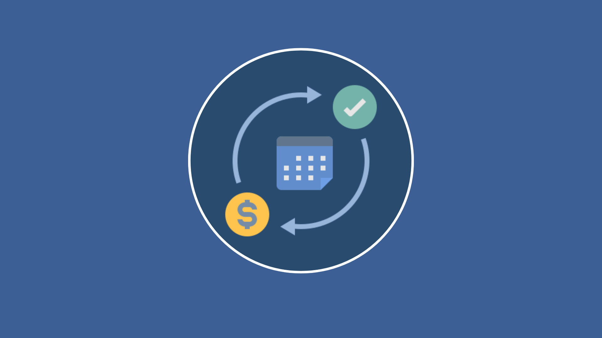

<div align="center"> 

# SubTrack



**Aplicativo de gerenciamento de assinaturas digitais**

</div>

## O desafio do controle financeiro digital

> Muitas pessoas têm várias assinaturas e dificuldade em lembrar valores, datas de cobrança e formas de pagamentos.

A proliferação de serviços digitais por assinatura transformou o consumo, mas trouxe complexidade e fragmentação ao gerenciamento financeiro pessoal.

- **Fragmentação de informações:**
  Dados dispersos em múltiplas plataformas dificultam a visão consolidada dos gastos.

- **Risco de esquecimento:**
  Renovações automáticas e datas de cobrança variadas levam a pagamentos indesejados.

- **Perda de controle:**
  Pequenos valores mensais somados representam impacto significativo no orçamento.

## SubTrack como solução

O SubTrack resolve essa fragmentação oferecendo uma plataforma única onde todas as informações relevantes são consolidadas e ficam facilmente acessíveis.

- **Repositório centralizado:**
  Todas as assinaturas organizadas em um único ambiente digital, eliminando múltiplas consultas.

- **Detalhamento completo:**
  Registro de nome, valor, dia de cobrança, categoria e notas personalizadas.

- **Gestão facilitada:**
  Edição, exclusão e botões de pagamento rápido para controle total.

## Funcionalidades principais do aplicativo

O SubTrack oferece um conjunto de recursos projetados para cobrir as necessidades do usuário no gerenciamento de assinaturas digitais.

- **Cadastro e edição:**
  Registro intuitivo de serviços com campos detalhados e ícones personalizados.

- **Dashboard analítico:**
  Resumo financeiro mensal consolidado com distribuição por categorias.

- **Calendário de cobranças:**
  Visualização cronológica das próximas faturas para melhor planejamento.

- **Pagamento rápido:**
  Botões de ação direta para agilizar a quitação dos serviços.

## Arquitetura tecnológica (stack)

A escolha criteriosa do stack tecnológico garante desempenho superior, manutenibilidade e experiência consistente.

- Expo
- React Native
- JavaScript
- Async Storage

## Benefícios para o usuário final

O SubTrack transforma a gestão de assinaturas em uma experiência simples, eficiente e visualmente agradável.

- **Controle financeiro:**
  Visão consolidada para economia e planejamento orçamentário mais preciso.

- **Autonomia offline:**
  Funcionamento completo sem dependência de conexão com a internet.

- **Acessibilidade:**
  Compatibilidade nativa com dispositivos móveis e acesso web.

## Roadmap de evolução e futuro

O desenvolvimento do SubTrack segue uma visão de longo prazo, estruturada para ampliar continuamente o valor entregue aos usuários.

- **Notificações inteligentes:**
  Alertas programáveis de cobrança para evitar esquecimentos e juros.

- **Análise gráfica:**
  Visualização interativa da evolução de gastos e categorias de consumo.

- **Compartilhamento:**
  Gestão colaborativa de assinaturas familiares e divisão de custos.

## Como rodar (local)

Pré-requisitos: **Node.js** e **npm**.

```bash
npm install

npx expo start
```

## Contribuidores do projeto

<table>
  <tr>
    <td align="center">
      <a href="#" title="defina o título do link">
        <br>
        <sub>
          <b>Airton Mamani</b>
        </sub>
      </a>
    </td>
    <td align="center">
      <a href="#" title="defina o título do link">
        <br>
        <sub>
          <b>Lucas Chambi</b>
        </sub>
      </a>
    </td>
  </tr>
</table>


